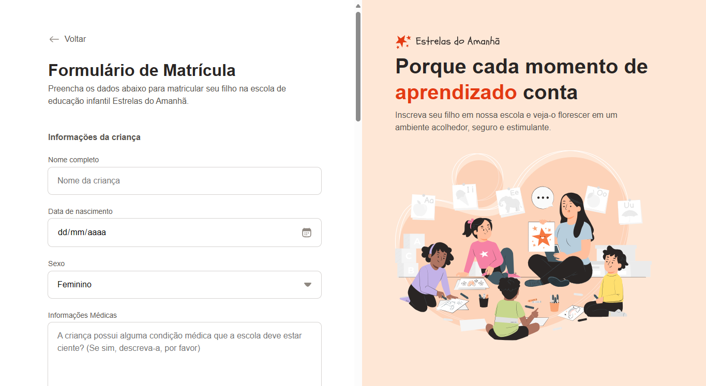

# Invitation Form UI 🔥

## Overview ✨

`Invitation Form UI` The project involves designing a form that includes various input types such as text, radio, checkbox, datetime-local, file, email, and tel. The form is styled using CSS, focusing on positioning, sizing, and theming of elements. The layout was also developed to define the space for the form and the header image.

## Features 🦾

- Responsive layout: The UI is designed for desktop and mobile screens.
- Basic form input types: The form supports a variety of input types as listed above.

## Contributing 🤼‍♂️

Contributions are what make the open-source community such an amazing place to learn, inspire, and create. Any contributions you make are **greatly appreciated**.

1. Fork the Project
2. Create your Feature Branch (`git checkout -b feature/AmazingFeature`)
3. Commit your Changes (`git commit -m 'Add some AmazingFeature'`)
4. Push to the Branch (`git push origin feature/AmazingFeature`)
5. Open a Pull Request
